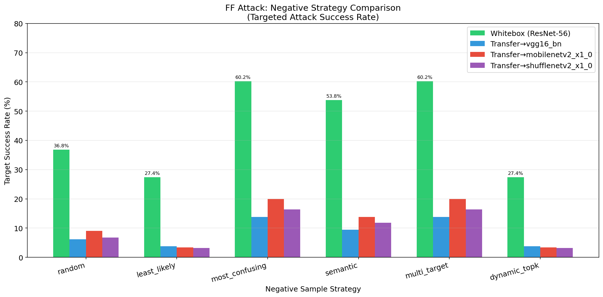
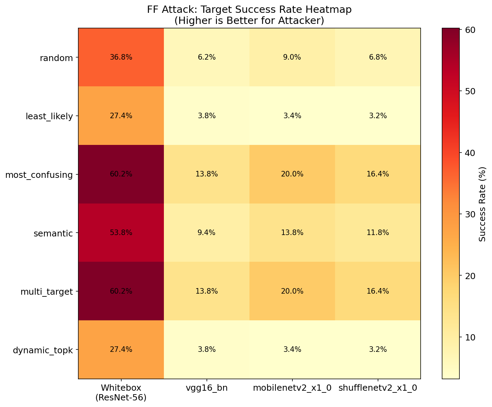
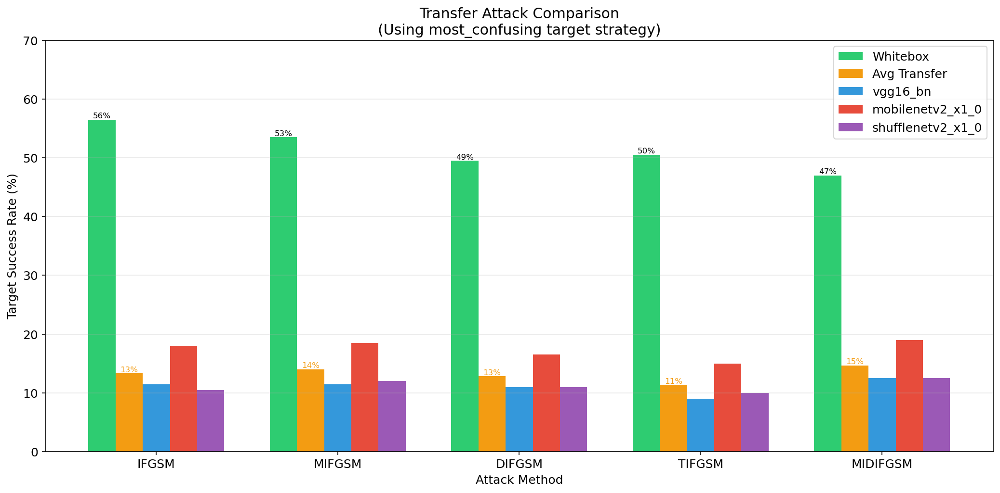
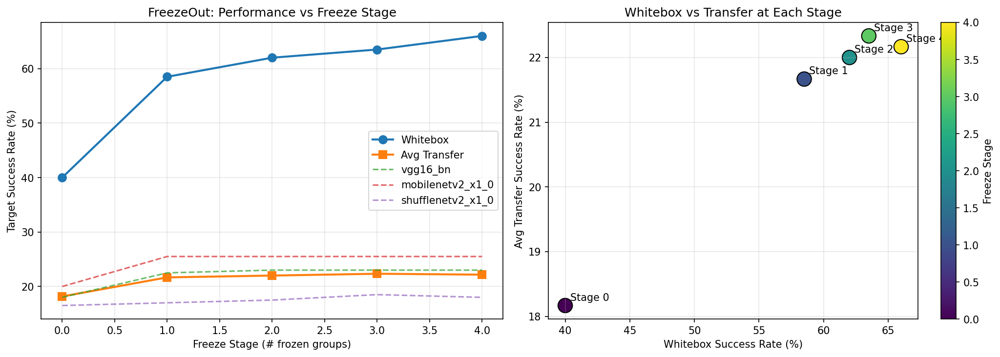

# AERO: Adversarial Example Research for Optimization

> 🚧 **Work in Progress** - Research on adversarial attacks and transferability

## Overview

This project studies **FreezeOut + FGSM (FF)** attack methods, focusing on:
1. **Negative Sample Strategies** - Impact of different target selection strategies on attack effectiveness
2. **Transferability** - Ability of adversarial examples to transfer from source to target models

## Progress

### ✅ Completed
- [x] Experiment framework
- [x] 6 negative sample strategies implemented
- [x] 19 pretrained models downloaded (CIFAR-10)
- [x] Initial experiments completed
- [x] Result visualization
- [x] Transfer bottleneck analysis

### 🔄 In Progress
- [x] Transfer enhancement techniques (MI, DI, TI) ✅
- [x] FreezeOut stage-wise transfer analysis ✅

### 📋 Planned
- [ ] Complete experiment report
- [ ] Paper-related analysis

## Experiment Results

### Negative Strategy Comparison (2024-02-04)

**Configuration:**
- Source Model: ResNet-56 (94.22% acc)
- Target Models: VGG16-BN, MobileNetV2, ShuffleNetV2
- Attack: FF, ε=8/255, 10 steps, 500 samples

**Target Success Rate:**

| Strategy | Whitebox | vgg16_bn | mobilenetv2_x1_0 | shufflenetv2_x1_0 |
|---|---|---|---|---|
| **most_confusing** | **60.2%** | **13.8%** | **20.0%** | **16.4%** |
| **multi_target** | **60.2%** | **13.8%** | **20.0%** | **16.4%** |
| semantic | 53.8% | 9.4% | 13.8% | 11.8% |
| random | 36.8% | 6.2% | 9.0% | 6.8% |
| least_likely | 27.4% | 3.8% | 3.4% | 3.2% |
| dynamic_topk | 27.4% | 3.8% | 3.4% | 3.2% |

### Visualization

<p align="center">
  
</p>

<p align="center">
  
</p>

### Key Findings

1. **most_confusing strategy is optimal** - Selecting the class the model is most likely to confuse (highest probability among non-true classes) works best
2. **least_likely strategy is worst** - Selecting the least likely class makes attacks harder to succeed
3. **Transfer rates are generally low** (~3-20%) - Requires further analysis and optimization

### Transfer Bottleneck Analysis (2024-02-04)

**Gradient Similarity Analysis:**
| Target Model | Cosine Similarity | Sign Match Rate |
|--------------|-------------------|-----------------|
| vgg16_bn | 0.086 | 52.1% |
| mobilenetv2 | 0.111 | 52.7% |
| shufflenetv2 | 0.108 | 52.8% |

**Key Findings:**
- ⚠️ **Extremely low gradient similarity** (~0.09-0.11) - Main cause of low transfer rate
- ⚠️ **Sign Match ~52%** - Nearly random, indicating almost uncorrelated gradient directions
- ✅ **95.8% low-frequency perturbations** - Low-frequency perturbations typically transfer better

**Improvement Directions:**
1. Input Diversity (DI-FGSM) to increase gradient diversity
2. Translation Invariance (TI-FGSM)
3. Momentum (MI-FGSM) for gradient accumulation
4. Multi-model ensemble attacks

### Transfer Enhancement Experiment (2024-02-04)

Comparing different transfer attack methods with `most_confusing` target strategy:

| Attack | Whitebox | Avg Transfer | vgg16_bn | mobilenetv2 | shufflenetv2 |
|--------|----------|--------------|----------|-------------|--------------|
| I-FGSM | 56.5% | 13.3% | 11.5% | 18.0% | 10.5% |
| **MI-FGSM** | 53.5% | 14.0% | 11.5% | 18.5% | 12.0% |
| DI-FGSM | 49.5% | 12.8% | 11.0% | 16.5% | 11.0% |
| TI-FGSM | 50.5% | 11.3% | 9.0% | 15.0% | 10.0% |
| **MI-DI-FGSM** | 47.0% | **14.7%** | **12.5%** | **19.0%** | **12.5%** |

<p align="center">
  
</p>

**Key Findings:**
- ✅ **MI-DI-FGSM achieves best transfer rate** (14.7%) by combining momentum and input diversity
- ✅ **MI-FGSM is second best** (14.0%) - momentum alone helps significantly
- ⚠️ **TI-FGSM performs worst** (11.3%) - translation invariance alone not effective here
- 📊 **Tradeoff observed**: Higher transfer often comes with lower whitebox success

### FreezeOut Stage Analysis (2024-02-04)

Analyzing how progressive layer freezing affects transferability:

| Stage | Frozen Groups | Whitebox | vgg16_bn | mobilenetv2 | shufflenetv2 |
|-------|---------------|----------|----------|-------------|--------------|
| 0 | 0 | 40.0% | 18.0% | 20.0% | 16.5% |
| 1 | 1 | 58.5% | **22.5%** | **25.5%** | 17.0% |
| 2 | 2 | 62.0% | 23.0% | 25.5% | 17.5% |
| 3 | 3 | 63.5% | 23.0% | 25.5% | 18.5% |
| 4 | 4 | 66.0% | 23.0% | 25.5% | 18.0% |

<p align="center">
  
</p>

**Key Findings:**
- ✅ **Early stages (0-1) contribute most to transfer** - Stage 1 achieves ~22% avg transfer
- ✅ **Later stages mainly improve whitebox** - Transfer saturates after stage 1-2
- 📊 **Stage 1 is optimal balance**: 58.5% whitebox with 21.7% avg transfer
- 💡 **Insight**: FreezeOut helps whitebox more than transfer; early unfrozen layers are key for transferability

### Comprehensive Benchmark (2024-02-04)

Comparing FF-FGSM with baselines (untargeted attack, misclassification rate):

| Attack | Whitebox | Avg Transfer | vgg16_bn | mobilenetv2 | shufflenetv2 | resnet20 |
|--------|----------|--------------|----------|-------------|--------------|----------|
| I-FGSM | 86.7% | 56.6% | 52.7% | 55.3% | 57.0% | 61.3% |
| MI-FGSM | 85.3% | 57.3% | 53.3% | 58.0% | 56.0% | 62.0% |
| DI-FGSM | 81.0% | 57.0% | 52.7% | 56.7% | 57.0% | 61.7% |
| **MI-DI-FGSM** | 81.7% | **58.4%** | 53.7% | **59.0%** | 57.7% | **63.3%** |
| FF | 85.3% | 57.4% | 53.3% | 58.3% | 56.0% | 62.0% |
| **FF-DI** | 81.0% | **58.1%** | 53.7% | 58.0% | 57.3% | **63.3%** |

**Key Findings:**
- 🏆 **MI-DI-FGSM is best** (58.4% avg transfer)
- 🥈 **FF-DI is very close** (58.1%) - FreezeOut + Input Diversity works well
- ✅ **FF achieves similar transfer to MI-FGSM** (57.4% vs 57.3%)
- 💡 **Combining FF with DI** closes the gap to state-of-the-art

## Project Structure

```
aero/
├── README.md
├── experiments/
│   ├── negative_strategies.py    # 6 negative strategy implementations
│   ├── hub_models.py             # torch.hub model loader
│   ├── run_ff_experiment.py      # FF experiment script
│   ├── analyze_transfer.py       # Transfer analysis script
│   ├── visualize_results.py      # Visualization script
│   ├── checkpoints/              # Pretrained models (19 models)
│   └── results/                  # Experiment results and figures
├── research/
│   └── ff_research_plan.md       # Research plan
└── data/                         # CIFAR-10 dataset
```

## Quick Start

```bash
# 1. Download pretrained models
cd experiments
python download_models.py --hub

# 2. Run experiments
python run_ff_experiment.py

# 3. Visualize results
python visualize_results.py

# 4. Analyze transfer bottleneck
python analyze_transfer.py
```

## Negative Strategy Descriptions

| Strategy | Description |
|----------|-------------|
| `random` | Randomly select a non-true class |
| `least_likely` | Select the class with lowest prediction probability |
| `most_confusing` | Select the class with highest probability among non-true classes |
| `semantic` | Select based on semantic similarity (e.g., cat→dog) |
| `multi_target` | Optimize towards multiple high-probability classes |
| `dynamic_topk` | Dynamically penalize top-k high-probability non-target classes |

## References

- [TransferAttack](https://github.com/Trustworthy-AI-Group/TransferAttack) - Transfer attack framework
- [TAA-Bench](https://github.com/KxPlaug/TAA-Bench) - Transfer attack benchmark
- [pytorch-cifar-models](https://github.com/chenyaofo/pytorch-cifar-models) - Pretrained models

## License

MIT
