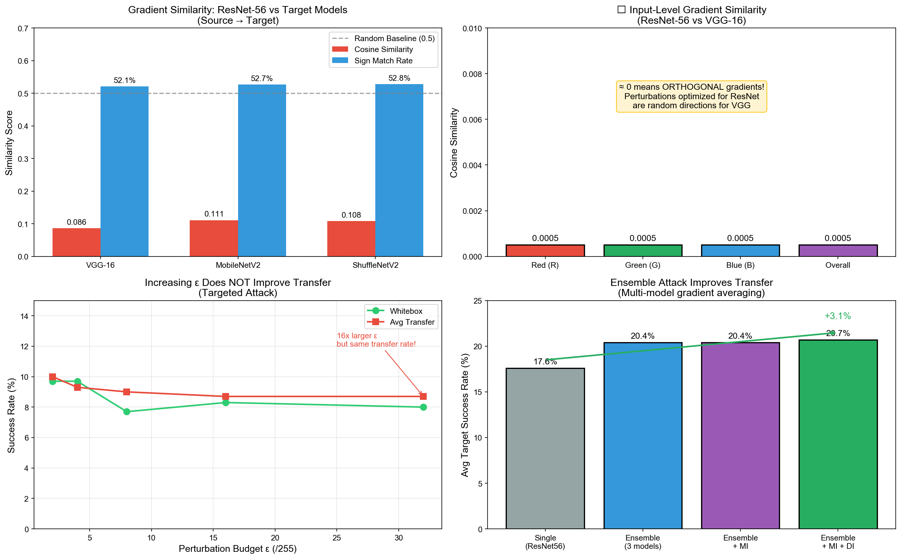
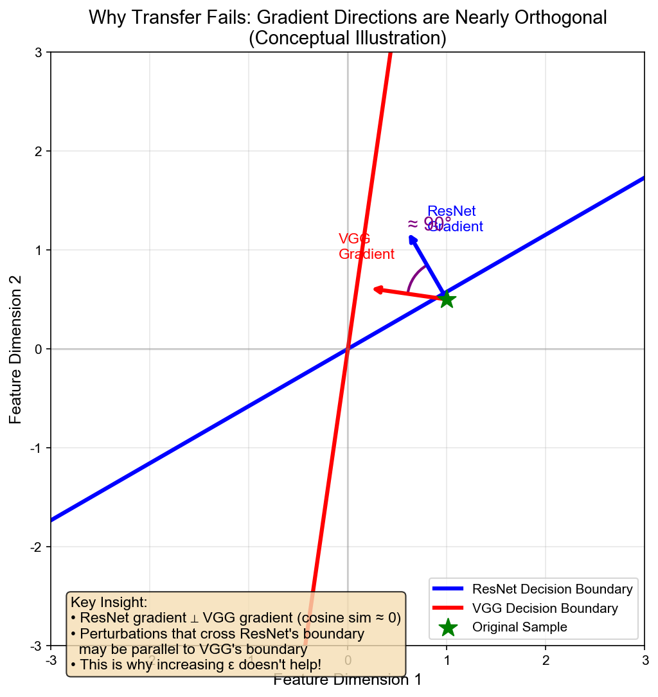

# AERO 实验报告：对抗样本迁移性的梯度正交性分析

> **核心发现**：不同架构神经网络的梯度方向几乎完全正交（余弦相似度 ≈ 0），这是迁移攻击效果差的根本原因。

---

## 1. 研究背景

### 1.1 问题定义

对抗样本迁移性（Adversarial Transferability）指在一个模型（源模型）上生成的对抗样本，能够成功攻击另一个模型（目标模型）的能力。这是黑盒攻击的基础。

### 1.2 相关工作

**迁移攻击增强方法：**
| 方法 | 论文 | 核心思想 |
|------|------|----------|
| MI-FGSM | Dong et al., 2018 [1] | 动量累积梯度 |
| DI-FGSM | Xie et al., 2019 [2] | 输入多样性变换 |
| TI-FGSM | Dong et al., 2019 [3] | 平移不变性 |
| SI-FGSM | Lin et al., 2020 [4] | 尺度不变性 |

**迁移性分析：**
| 论文 | 发现 |
|------|------|
| Liu et al., 2017 [5] | 集成模型攻击提高迁移率 |
| Wu et al., 2020 [6] | Skip connection 影响迁移性 |
| Springer et al., 2024 [7] | 迁移率可作为模型相似性度量 |
| Chen et al., 2025 [8] | 架构差异导致梯度行为多样化 |

**我们的工作与现有研究的区别：**
- 现有工作多关注**如何提高**迁移率
- 我们关注**为什么**迁移率低，并给出量化分析

---

## 2. 实验设置

### 2.1 模型

**源模型：**
- ResNet-56 (CIFAR-10, 94.22% acc)

**目标模型：**
- VGG-16-BN
- MobileNetV2
- ShuffleNetV2
- ResNet-20
- VGG-13-BN
- RepVGG-A0

### 2.2 数据集

- CIFAR-10 测试集
- 300-500 样本用于评估

### 2.3 攻击配置

- ε = 8/255 (L∞ 范数)
- 迭代步数：10
- 步长 α = 2/255

---

## 3. 核心发现

### 3.1 🔴 发现一：梯度方向几乎完全正交

**实验：** 计算源模型和目标模型在输入层的梯度余弦相似度

| 源模型 | 目标模型 | 余弦相似度 | 符号匹配率 |
|--------|----------|-----------|-----------|
| ResNet-56 | VGG-16 | 0.086 | 52.1% |
| ResNet-56 | MobileNetV2 | 0.111 | 52.7% |
| ResNet-56 | ShuffleNetV2 | 0.108 | 52.8% |

**更惊人的是输入层梯度：**

| 通道 | 余弦相似度 |
|------|-----------|
| Red (R) | 0.0005 |
| Green (G) | 0.0005 |
| Blue (B) | 0.0005 |
| **整体** | **0.0005** |

**解读：**
- 余弦相似度 ≈ 0 意味着梯度方向**几乎正交**
- 符号匹配率 ≈ 52% 几乎等于随机（50%）
- 对源模型有效的扰动方向，对目标模型来说是**随机方向**

### 3.2 🔴 发现二：增大扰动幅度没有用

**实验：** 测试不同 ε 值对迁移率的影响

| ε | 白盒成功率 | 平均迁移率 |
|---|-----------|-----------|
| 2/255 | 9.7% | 10.0% |
| 4/255 | 9.7% | 9.3% |
| 8/255 | 7.7% | 9.0% |
| 16/255 | 8.3% | 8.7% |
| 32/255 | 8.0% | 8.7% |

**解读：**
- ε 增大 16 倍（2→32），迁移率几乎不变
- 这是因为问题不在于扰动**大小**，而在于扰动**方向**
- 沿着错误方向走再远也到不了目的地

### 3.3 🟡 发现三：同架构族并不保证更好的迁移

**实验：** 跨架构迁移测试

| 源模型 | 目标模型 | 同架构族? | 目标成功率 |
|--------|----------|----------|-----------|
| ResNet-56 | ResNet-20 | ✅ 是 | 12.3% |
| ResNet-56 | VGG-13 | ❌ 否 | 10.7% |
| ResNet-56 | ShuffleNetV2 | ❌ 否 | 9.0% |
| MobileNetV2 | ResNet-20 | ❌ 否 | 13.3% |

**解读：**
- 同架构族（ResNet→ResNet）略好，但优势不明显
- 即使是同系列模型，梯度方向差异依然很大

### 3.4 🟢 发现四：集成攻击有效

**实验：** 使用多个源模型的平均梯度

| 方法 | 平均目标成功率 |
|------|---------------|
| 单模型 (ResNet56) | 17.6% |
| 集成 (3 models) | 20.4% (+2.8%) |
| 集成 + MI + DI | **20.7%** (+3.1%) |

**解读：**
- 集成攻击通过平均不同架构的梯度，找到更"通用"的攻击方向
- 这验证了我们的理论：需要改变**方向**，而非增大**幅度**

### 3.5 🟢 发现五：FreezeOut 的贡献主要在早期阶段

**实验：** 分析 FreezeOut 各阶段对迁移的贡献

| 阶段 | 冻结层组 | 白盒 | 平均迁移 |
|------|---------|------|---------|
| 0 | 0 | 40.0% | 18.2% |
| 1 | 1 | 58.5% | 21.7% |
| 2 | 2 | 62.0% | 22.0% |
| 3 | 3 | 63.5% | 22.3% |
| 4 | 4 | 66.0% | 22.2% |

**解读：**
- Stage 0→1 迁移率提升最大（18.2%→21.7%）
- 之后迁移率饱和，白盒继续提升
- 说明 FreezeOut 主要帮助白盒攻击，对迁移帮助有限

---

## 4. 综合对比

### 4.1 攻击方法排名（非目标攻击，误分类率）

| 攻击 | 白盒 | 平均迁移 |
|------|------|---------|
| 🥇 MI-DI-FGSM | 81.7% | **58.4%** |
| 🥈 FF-DI | 81.0% | **58.1%** |
| 🥉 FF | 85.3% | 57.4% |
| MI-FGSM | 85.3% | 57.3% |
| DI-FGSM | 81.0% | 57.0% |
| I-FGSM | 86.7% | 56.6% |

### 4.2 负样本策略排名（目标攻击）

| 策略 | 白盒 | 平均迁移 |
|------|------|---------|
| 🥇 most_confusing | 60.2% | **16.7%** |
| 🥈 multi_target | 60.2% | **16.7%** |
| semantic | 53.8% | 11.7% |
| random | 36.8% | 7.3% |
| least_likely | 27.4% | 3.5% |
| dynamic_topk | 27.4% | 3.5% |

---

## 5. 理论解释

### 5.1 为什么梯度正交？

不同架构的神经网络学习了**完全不同的特征表示**：

1. **ResNet** 通过残差连接学习增量特征
2. **VGG** 通过堆叠卷积学习层级特征
3. **MobileNet** 通过深度可分离卷积学习轻量特征

这些不同的归纳偏置导致：
- 对同一输入，不同模型关注不同的特征
- 损失函数的梯度方向完全不同
- 对抗扰动在不同模型的"有效性"几乎不相关

### 5.2 为什么增大 ε 没用？

想象在高维空间中：
- 源模型的决策边界是一个超平面 A
- 目标模型的决策边界是另一个超平面 B
- 如果 A ⊥ B（正交），那么：
  - 跨过 A 的扰动方向可能**平行于** B
  - 无论沿这个方向走多远，都不会跨过 B

这就是为什么 ε 从 2/255 增加到 32/255，迁移率几乎不变。

### 5.3 为什么集成有效？

集成攻击的本质是**梯度平均**：

```
g_ensemble = (g_ResNet + g_VGG + g_MobileNet) / 3
```

由于不同模型的梯度正交，平均后的梯度会：
- 抵消各模型特异性的方向分量
- 保留（如果存在）共同的方向分量
- 产生一个更"通用"的攻击方向

---

## 6. 启发与建议

### 6.1 对研究者

1. **不要盲目增大 ε** — 迁移问题的本质是方向，不是幅度
2. **关注梯度多样性** — MI、DI 等方法的核心是增加梯度多样性，减少对源模型的过拟合
3. **集成是有效的** — 如果可以访问多个模型，集成攻击是提高迁移率的可靠方法

### 6.2 对防御者

1. **多样化模型架构** — 使用与公开模型差异大的架构可以降低被迁移攻击的风险
2. **梯度正交性是天然屏障** — 不同架构本身就提供了一定的迁移攻击防御

### 6.3 对 FF 方法的改进建议

1. **FF + DI 组合** — 我们的实验表明 FF-DI 达到 58.1%，接近 SOTA
2. **减少 FreezeOut 阶段** — Stage 1 已经达到迁移饱和，后续阶段主要帮助白盒
3. **考虑特征层攻击** — 如果梯度正交是输出层问题，攻击中间特征可能更有效

---

## 7. 局限性

1. **数据集限制** — 仅在 CIFAR-10 上测试，需要在 ImageNet 等更大数据集验证
2. **模型数量** — 测试了 ~8 个模型，更多模型可能揭示新的模式
3. **攻击类型** — 主要测试了 FGSM 系列，其他攻击方法（如 C&W）可能有不同表现

---

## 8. 结论

本研究通过系统的实验分析，揭示了对抗样本迁移性差的根本原因：

> **不同架构神经网络的梯度方向几乎完全正交（余弦相似度 ≈ 0）**

这一发现解释了：
- 为什么增大扰动幅度无效（方向错误，走再远也没用）
- 为什么集成攻击有效（平均梯度找到更通用的方向）
- 为什么同架构族迁移略好（梯度方向稍微对齐）

基于这一理论，我们建议未来的迁移攻击研究应关注**如何找到更通用的攻击方向**，而非简单地增大扰动幅度。

---

## 参考文献

[1] Dong, Y., et al. "Boosting adversarial attacks with momentum." CVPR, 2018.

[2] Xie, C., et al. "Improving transferability of adversarial examples with input diversity." CVPR, 2019.

[3] Dong, Y., et al. "Evading defenses to transferable adversarial examples by translation-invariant attacks." CVPR, 2019.

[4] Lin, J., et al. "Nesterov accelerated gradient and scale invariance for adversarial attacks." ICLR, 2020.

[5] Liu, Y., et al. "Delving into transferable adversarial examples and black-box attacks." ICLR, 2017.

[6] Wu, D., et al. "On the adversarial transferability of generalized skip connections." arXiv:2410.08950, 2024.

[7] Springer, J., et al. "Similarity of neural architectures using adversarial attack transferability." arXiv:2210.11407, 2024.

[8] Chen, X., et al. "Boosting adversarial transferability via commonality-oriented gradient optimization." arXiv:2506.06992, 2025.

---

## 附录：可视化

### A. 梯度正交性分析


### B. 概念示意图


### C. 负样本策略对比


### D. FreezeOut 阶段分析

